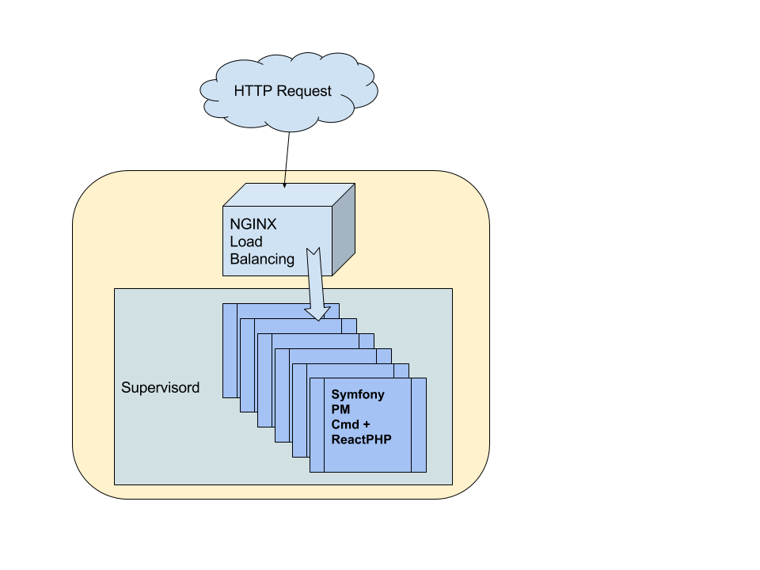

PHP Process Manager Bundle for Symfony Applications
===================================================

**Bring High Performance Into Your Symfony App !**

To kill the expensive bootstrap of PHP and Symfony, this bundle add a simple symfony command to start a process manager using ReactPHP.

This PHP process manager is Symfony specific and designed to be used with a process control system like [supervisord](http://supervisord.org/) - more reliable and avoid reinventing the wheel.

Inspired from [php-pm](https://github.com/php-pm/php-pm).

## Command

```bash
php app/console m6web:http-process [listening-port]
```

Availables options :

- `--memory-max` - Gracefully stop running command when given memory volume, in megabytes, is reached (exit 10)
- `--check-interval` - Interval used to periodically check if we should stop the daemon (in seconds)

## Quick start

Install the bundle :

```bash
composer require m6web/php-process-manager-bundle
```

In AppKernel.php :

```php
 new M6Web\Bundle\PhpProcessManagerBundle\M6WebPhpProcessManagerBundle(),
```

Start the command :

```bash
php app/console m6web:http-process 8000
```

And open http://localhost:8000 !

## Advanced setup (load balancing)



### Symfony

Install the bundle :

```bash
composer require m6web/php-process-manager-bundle
```

In AppKernel.php :

```php
 new M6Web\Bundle\PhpProcessManagerBundle\M6WebPhpProcessManagerBundle(),
 ```

### [Supervisord](http://supervisord.org/)

Example for 8 workers, listening from 8000 to 8007

```ini
[program:mysfproject]
command=php -d memory_limit=1024M app/console m6web:http-process 80%(process_num)02d --env=dev --memory-max=768 --check-interval=60 ; the program (relative uses PATH, can take args)
process_name=%(program_name)s-%(process_num)d ; process_name expr (default %(program_name)s)
numprocs=8                     ; number of processes copies to start (def 1)
directory=/path/to/symfony/    ; directory to cwd to before exec (def no cwd)
umask=022                      ; umask for process (default None)
user=www-data                  ; setuid to this UNIX account to run the program
stdout_logfile=/var/log/supervisord/%(program_name)s-%(process_num)d.log              ; stdout log path, NONE for none; default AUTO
stderr_logfile=/var/log/supervisord/%(program_name)s-%(process_num)d-error.log        ; stderr log path, NONE for none; default AUTO
```

### [NGINX](https://www.nginx.com/resources/wiki/)

Example config for NGiNX and 8 workers:

```nginx
upstream backend  {
    server 127.0.0.1:8000 max_fails=1 fail_timeout=5s;
    server 127.0.0.1:8001 max_fails=1 fail_timeout=5s;
    server 127.0.0.1:8002 max_fails=1 fail_timeout=5s;
    server 127.0.0.1:8003 max_fails=1 fail_timeout=5s;
    server 127.0.0.1:8004 max_fails=1 fail_timeout=5s;
    server 127.0.0.1:8005 max_fails=1 fail_timeout=5s;
    server 127.0.0.1:8006 max_fails=1 fail_timeout=5s;
    server 127.0.0.1:8007 max_fails=1 fail_timeout=5s;
}

server {
    root /path/to/symfony/web/;
    server_name servername.com;
    location / {
        try_files $uri @backend;
    }
    location @backend {
        proxy_pass http://backend;
        proxy_next_upstream http_502 timeout error;
        proxy_connect_timeout 1;
        proxy_send_timeout 5;
        proxy_read_timeout 5;
    }
}
```

Example config for NGiNX and 8 workers with fallback on php-fpm:

```nginx
upstream backend  {
    server 127.0.0.1:8000 max_fails=1 fail_timeout=5s;
    server 127.0.0.1:8001 max_fails=1 fail_timeout=5s;
    server 127.0.0.1:8002 max_fails=1 fail_timeout=5s;
    server 127.0.0.1:8003 max_fails=1 fail_timeout=5s;
    server 127.0.0.1:8004 max_fails=1 fail_timeout=5s;
    server 127.0.0.1:8005 max_fails=1 fail_timeout=5s;
    server 127.0.0.1:8006 max_fails=1 fail_timeout=5s;
    server 127.0.0.1:8007 max_fails=1 fail_timeout=5s;
}

server {
    root /path/to/symfony/web/;
    server_name servername.com;

    location / {
        try_files $uri @phppm;
    }

    location @phppm {
        proxy_pass http://backend;
        proxy_next_upstream http_502 timeout error;
        proxy_connect_timeout 1;
        proxy_send_timeout 5;
        proxy_read_timeout 5;

        proxy_intercept_errors on;
        recursive_error_pages on;
        error_page 502 = @phpfpm;
    }

    location @phpfpm {
        try_files $uri /app_local.php$is_args$args;
    }

    location ~ ^/app_local\.php(/|$) {
        fastcgi_split_path_info ^(.+\.php)(/.*)$;

        include       /etc/nginx/fastcgi_params;

        fastcgi_param SCRIPT_FILENAME $realpath_root$fastcgi_script_name;
        fastcgi_pass  unix:/var/run/php-fpm/www.sock;
    }
}
```
